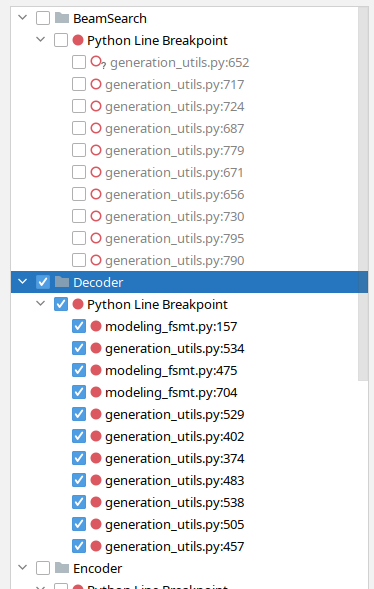

# Porting fairseq wmt19 translation system to transformers

This is an attempt to documented how [fairseq wmt19 translation system](https://github.com/pytorch/fairseq/tree/master/examples/wmt19) was ported to [`transformers`](https://github.com/huggingface/transformers/).

I was looking for some interesting project to work on and [Sam Shleifer](https://github.com/sshleifer) suggested I work on [porting a high quality translator](https://github.com/huggingface/transformers/issues/5419).

I read the short paper: [Facebook FAIR's WMT19 News Translation Task Submission](https://arxiv.org/abs/1907.06616) that describes the original system and decided to give it a try.

I had no idea how to approach this complex problem and Sam helped me to [break it down to smaller tasks](https://github.com/huggingface/transformers/issues/5419), which was of a great help.

I chose to work with the en-ru/ru-en models during porting as I speak both languages. It'd have been much more difficult to work with de-en/en-de as I don't speak German, and being able to evaluate the translation quality by just reading and making sense of the outputs at the advanced stages of the porting process saved me a ton of time.

Also, as I did the porting with the en-ru/ru-en models, I was totally unaware that the de-en/en-de models used a merged vocabulary, whereas the former used 2 separate vocabularies of different sizes. So once I did the more complicated work of supported 2 separate vocabularies, it was trivial to get the merged vocabulary to work.

## Let's cheat

The first step was to cheat, of course. Why make a complex effort when one can make a little one. So I wrote a [short notebook](./nbs/cheat.ipynb) that in a few lines of code provided a proxy to fairseq and emulated `transformers` API. 

If no other things but basic translation was required, this would have been enough. But, of course, we wanted to have the full porting, so after having this small victory, I moved onto much harder things.

## Installations

For the sake of this article let's assume that we work under `~/porting`, so let's create this directory:
```
mkdir ~/porting
cd ~/porting
```

We need to install a few things for this work:

```
# install fairseq
git clone https://github.com/pytorch/fairseq
cd fairseq
pip install -e .
# install mosesdecoder under fairseq
git clone https://github.com/moses-smt/mosesdecoder
# install fastBPE under fairseq
git clone git@github.com:glample/fastBPE.git
cd fastBPE; g++ -std=c++11 -pthread -O3 fastBPE/main.cc -IfastBPE -o fast; cd -
cd -

# install transformers
git clone https://github.com/huggingface/transformers/
pip install -e .[dev]

```

## Files

To get an idea of what needs to be done code-wise, the following files need to be created when the work is completed:

* [src/transformers/configuration_fsmt.py](https://github.com/huggingface/transformers/blob/129fdae04033fe4adfe013b734deaec6ec34ae2e/src/transformers/configuration_fsmt.py) -  a short configuration class.
* [src/transformers/convert_fsmt_original_pytorch_checkpoint_to_pytorch.py](https://github.com/huggingface/transformers/blob/129fdae04033fe4adfe013b734deaec6ec34ae2e/src/transformers/convert_fsmt_original_pytorch_checkpoint_to_pytorch.py) - a complex conversion script. 
* [src/transformers/modeling_fsmt.py](https://github.com/huggingface/transformers/blob/129fdae04033fe4adfe013b734deaec6ec34ae2e/src/transformers/modeling_fsmt.py) - this is where the model architecture is implemented.
* [src/transformers/tokenization_fsmt.py](https://github.com/huggingface/transformers/blob/129fdae04033fe4adfe013b734deaec6ec34ae2e/src/transformers/tokenization_fsmt.py) - a tokenizer code
* [tests/test_modeling_fsmt.py](https://github.com/huggingface/transformers/blob/129fdae04033fe4adfe013b734deaec6ec34ae2e/src/transformers/tests/test_modeling_fsmt.py) - model tests
* [tests/test_tokenization_fsmt.py](https://github.com/huggingface/transformers/blob/129fdae04033fe4adfe013b734deaec6ec34ae2e/src/transformers/tests/test_tokenization_fsmt.py) - tokenizer tests
* [docs/source/model_doc/fsmt.rst](https://github.com/huggingface/transformers/blob/129fdae04033fe4adfe013b734deaec6ec34ae2e/src/transformers/docs/source/model_doc/fsmt.rst) - a doc file

there are other files that need to be modified as well, we will talk about those towards the end.


## Conversion

One of the most important parts of the porting process is creating the conversion script. It will take all the available source data provided by the original developer of the model, which includes checkpoint with pre-trained weights, model and training configuration details, dictionaries and tokenizer support files, and convert them into a new set of files supported by `transformers`. You will find the final script here: [src/transformers/convert_fsmt_original_pytorch_checkpoint_to_pytorch.py](https://github.com/huggingface/transformers/blob/129fdae04033fe4adfe013b734deaec6ec34ae2e/src/transformers/convert_fsmt_original_pytorch_checkpoint_to_pytorch.py)

I started by copying one of the existing conversion scripts, gutted most of it out and then gradually added parts to it as I was porting part by part.

During the development I was testing all my code against a local copy of the converted model, and only at the very end when everything was ready I uploaded it to s3 and then continued testing against this version.

## fairseq model and its support files

Let's first look at what data we get with the fairseq model. We are going to use the convenient `torch.hub` API, which makes it very easy to apply the models.
```
import torch
torch.hub.load('pytorch/fairseq', 'transformer.wmt19.en-ru', checkpoint_file='model4.pt', tokenizer='moses', bpe='fastbpe')
```
This code downloads the model and its support files. To look inside we have to hunt down the downloaded files in the `~/.cache` folder.

```
ls -1 ~/.cache/torch/hub/pytorch_fairseq/
```
shows:
```
15bca559d0277eb5c17149cc7e808459c6e307e5dfbb296d0cf1cfe89bb665d7.ded47c1b3054e7b2d78c0b86297f36a170b7d2e7980d8c29003634eb58d973d9
15bca559d0277eb5c17149cc7e808459c6e307e5dfbb296d0cf1cfe89bb665d7.ded47c1b3054e7b2d78c0b86297f36a170b7d2e7980d8c29003634eb58d973d9.json
```

Let's make a symlink so that we can easily refer to that obscured cache folder down the road:

```
ln -s /code/data/cache/torch/hub/pytorch_fairseq/15bca559d0277eb5c17149cc7e808459c6e307e5dfbb296d0cf1cfe89bb665d7.ded47c1b3054e7b2d78c0b86297f36a170b7d2e7980d8c29003634eb58d973d9 ~/porting/pytorch_fairseq_model
```

Note: the path could be different when you try it yourself, since the hash value of the model could change. You will find the right one in `~/.cache/torch/hub/pytorch_fairseq/`

If we look inside that folder:
```
ls -l ~/porting/pytorch_fairseq_model/
total 13646584
-rw-rw-r-- 1 stas stas     532048 Sep  8 21:29 bpecodes
-rw-rw-r-- 1 stas stas     351706 Sep  8 21:29 dict.en.txt
-rw-rw-r-- 1 stas stas     515506 Sep  8 21:29 dict.ru.txt
-rw-rw-r-- 1 stas stas 3493170533 Sep  8 21:28 model1.pt
-rw-rw-r-- 1 stas stas 3493170532 Sep  8 21:28 model2.pt
-rw-rw-r-- 1 stas stas 3493170374 Sep  8 21:28 model3.pt
-rw-rw-r-- 1 stas stas 3493170386 Sep  8 21:29 model4.pt
```
we have:
1. `model*.pt` - 4 checkpoints (pytorch `state_dict` with all the pretrained weights, and various other things)
2. `dict.*.txt` - source and target dictionaries
3. `bpecodes` - special map file for BPE work

We are going to investigate each of these files in the following sections.

## How translation systems work

Here is a bit of an introduction to how a computer translates text nowadays.

Computers can't read text, but can only handle numbers. So when working with text we have to map one or more letters into numbers, and hand those to a computer program. When the program completes it too returns  numbers, which we need to convert back into text. 

Let's start with two sentences in Russian and English:
```
я  люблю следовательно я  существую
10 11    12            10 13

I  love therefore I  am
20 21   22        20 23
```

Let's assign a unique number to each word. The numbers starting with 10 are a map of Russian words to unique numbers. The numbers starting with 20 are a different map for English words. If you don't speak Russian, you can still see that the word `я` repeats twice in the sentence and it gets the same number 10 associated with it. Same goes for `I` (20).

A translation system works in the following stages:

```
1. [я люблю следовательно я существую] # tokenize sentence into words
2. [10 11 12 10 13]                    # look up words in the input dictionary
3. [black box]                         # machine learning system magic
4. [20 21 22 20 23]                    # look up numbers in the output dictionary
5. [I love therefore I am]             # detokenize the tokens back into a sentence
```

The first two and the last two are each combined so that we get 3 stages:

1. Encoding input: break input text into tokens, create a vocabulary of these tokens and remap each token into a number
2. Generating translation: Take input numbers, process them and return output numbers
3. Decoding output: Take output numbers, look them up in the target language dictionary and convert to text, and finally merge the converted tokens into the translated sentence.

## Tokenization

Early systems tokenized sentences into words and punctuation. But since many languages have hundreds of thousands of words it is very taxing to work with huge vocabularies. 

As of 2020 there are quite a few different versions of tokenizers, but most of the recent ones are based on sub-word tokenization - that is instead of breaking the input text into words, it breaks them down into word segments and letters. 

Let's see how this approach helps to save space. If we have an input vocabulary of 6 common words: go, going, speak, speaking, sleep, sleeping - with word-level tokenization we end up with 6 tokens. However, if we break these down into: go, go-ing, speak, speak-ing, then we have only 4 tokens in our vocabulary: go, speak, sleep, ing. That's a huge saving. 

Another important advantage is when dealing with unseen words, that aren't in our vocabulary. For example, let's say our system encounters the word 'grokking' (*), which can't be found in its vocabulary. If we split it into `grokk'-'ing', then the system might not know what to do with the first part of the word, but it gets a useful insight that 'ing' indicates a continuous tense, so it'll be able to produce a better translation.

* to grok was coined in 1961 by Robert A. Heinlein in "Stranger in a Strange Land": understand (something) intuitively or by empathy.

There are many other nuances to why the modern tokenization approach is much more superior than simple word tokenization, which won't be covered in this scope. Most of these systems are very complex to how they do the tokenization, as compared to the simple example of splitting `ing` endings that was just demonstrated.


## Tokenizer porting

The first step was to port the encoder part of the tokenizer. The decoder part won't be needed until the very end.

### fairseq's tokenizer workings

Let's understand how fairseq's tokenizer works.

fairseq uses the [Byte Pair Encoding](https://en.wikipedia.org/wiki/Byte_pair_encoding) method (BPE) for tokenization. 

* note: from here on when I refer to fairseq, I refer to the specific   [implementation](https://github.com/pytorch/fairseq/tree/master/examples/wmt19) - the project itself has dozens of different implementations of different models.

Let's see what it means:

```
import torch
sentence = "Machine Learning is great"
checkpoint_file='model4.pt'
model = torch.hub.load('pytorch/fairseq', 'transformer.wmt19.en-ru', checkpoint_file=checkpoint_file, tokenizer='moses', bpe='fastbpe')

# encode step by step
tokens = model.tokenize(sentence)
"tokenize ", tokens

bpe = model.apply_bpe(tokens)
"apply_bpe: ", bpe

bin = model.binarize(bpe)
"binarize: ", len(bin), bin

# compare to model.encode - should give us the same output
expected = model.encode(sentence)
"encode:   ", len(expected), expected
```

gives us:

```
('tokenize ', 'Machine Learning is great')
('apply_bpe: ', 'Mach@@ ine Lear@@ ning is great')
('binarize: ', 7, tensor([10217,  1419,     3,  2515,    21,  1054,     2]))
('encode:   ', 7, tensor([10217,  1419,     3,  2515,    21,  1054,     2]))
```

You can see that `model.encode` does `tokenize+apply_bpe+binarize` - we get the same output. 

The steps were:
1. tokenize: normally it'd escape apostrophes and do other pre-processing, in this example it just returned the input as it was
2. apply_bpe: bpe split the input into words and sub-words according to its `bpecodes` file supplied by the tokenizer - we get 6 BPE chunks
3. binarize: this simply remaps the bpe chunks from the previous step into their corresponding ids in the vocabulary (which is also downloaded with the model)

You can refer to [this notebook](./nbs/tokenizer.ipynb) to see more details.

This is a good time to look inside the `bpecodes` file. Here is the top of the file:

```
# head -15 ~/porting/pytorch_fairseq_model/bpecodes
e n</w> 1423551864
e r 1300703664
e r</w> 1142368899
i n 1130674201
c h 933581741
a n 845658658
t h 811639783
e n 780050874
u n 661783167
s t 592856434
e i 579569900
a r 494774817
a l 444331573
o r 439176406
th e</w> 432025210
[...]
```

The top entries of this file include very frequent short codes. As we will see in a moment the bottom includes the most common multi-letter coders and even full long words. 

A special token `</w>` indicates that the end of the word. So in the few lines above we find:
```
e n</w> 1423551864
e r</w> 1142368899
th e</w> 432025210
```
If the second column doesn't include `</w>`, it means that it's found in the middle of the word and not the end of it.

The last column informs us of how many times this BPE code has been encountered, and this file is sorted by this column - so the most common BPE codes are on top.

By looking at the counts we now know that when this tokenizer was trained it encountered 1,423,551,864 words ending in `en`, 1,142,368,899 words ending in `er` and 432,025,210 words ending in `the`. For the latter it most likely means the actual word `the`, but it would also include words like `lathe`, `loathe`, `tithe`, etc.

This also immediately tells you that this tokenizer was trained on an enormous amount of text!

If we look at the bottom of the file:

```
# tail -10 ~/porting/pytorch_fairseq_model/bpecodes
4 x 109019
F ische</w> 109018
sal aries</w> 109012
e kt 108978
ver gewal 108978
Sten cils</w> 108977
Freiwilli ge</w> 108969
doub les</w> 108965
po ckets</w> 108953
Gö tz</w> 108943
```
we see complex combinations of sub-words which are still pretty frequent, e.g. `sal aries` for 109,012 times! so it got its own dedicated entry in the `bpecodes` map file.

How does `apply_bpe` does its work? By looking up the various combinations of letters in the `bpecodes` map file and when finding the most complex entry that fits it uses that. Going back to our example, we saw that it split `Machine` into: `Mach@@` + `ine` - let's check:

```
# grep -i ^mach  ~/porting/pytorch_fairseq_model/bpecodes
mach ine</w> 463985
Mach t 376252
Mach ines</w> 374223
mach ines</w> 214050
Mach th 119438
```
You can see that it has `mach ine</w>`. We don't see `Mach ine` in there - so it must be handling lower cased look ups when normal case is not matching.

Now let's check: `Lear@@` + `ning`

```
# grep -i ^lear  ~/porting/pytorch_fairseq_model/bpecodes
lear n</w> 675290
lear ned</w> 505087
lear ning</w> 417623
```
In there you have it `lear ning</w>` is there (again the case is not the same).

Hopefully, you can now see how this works.

One confusing thing is that if you remember the `apply_bpe` output was:
```
('apply_bpe: ', 6, ['Mach@@', 'ine', 'Lear@@', 'ning', 'is', 'great'])
```
Instead of marking endings of the words with `</w>`, it leaves those as is, but instead marks words that were not the endings with `@@`. This is probably so, because `fastBPE` implementation is used by fairseq and that's how it does things. We will make these things consistent during porting since we don't use `fastBPE`.

One last thing to check is the remapping of the BPE codes to vocabulary ids. To repeat, we had:

```
('apply_bpe: ', 'Mach@@ ine Lear@@ ning is great')
('binarize: ', 7, tensor([10217,  1419,     3,  2515,    21,  1054,     2]))
```

`2` - the last token id is a `eos` (end of stream) token. It's used to indicate that the end of input.

And then `Mach@@` gets remapped to `10217`, and `ine` to `1419`. 

Let's check that the dictionary file is in agreement:

```
# grep ^Mach@@ ~/porting/pytorch_fairseq_model/dict.en.txt
Mach@@ 6410
# grep "^ine " ~/porting/pytorch_fairseq_model/dict.en.txt
ine 88376
```
Wait a second - those aren't the ids that we got after `binarize`, which should be `10217` and `1419` correspondingly. It took some digging to find out that the vocab file ids aren't the ids used by the model and that internally it remaps them to new ids once the vocab file is loaded. Luckily I didn't need to figure out how exactly it was done. Instead, I just used `fairseq.data.dictionary.Dictionary.load` to load the dict, which included all the re-mappings, - and then saved the final dictionary. I found out about that `Dictionary` class by running fairseq code with debugger.

Here is the relevant part of the conversion script:

```
from fairseq.data.dictionary import Dictionary
def rewrite_dict_keys(d):
    # (1) remove word breaking symbol, (2) add word ending symbol where the word is not broken up,
    # e.g.: d = {'le@@': 5, 'tt@@': 6, 'er': 7} => {'le': 5, 'tt': 6, 'er</w>': 7}
    d2 = dict((re.sub(r"@@$", "", k), v) if k.endswith("@@") else (re.sub(r"$", "</w>", k), v) for k, v in d.items())
    keep_keys = "<s> <pad> </s> <unk>".split()
    # restore the special tokens
    for k in keep_keys:
        del d2[f"{k}</w>"]
        d2[k] = d[k]  # restore
    return d2

src_dict_file = os.path.join(fsmt_folder_path, f"dict.{src_lang}.txt")
src_dict = Dictionary.load(src_dict_file)
src_vocab = rewrite_dict_keys(src_dict.indices)
src_vocab_size = len(src_vocab)
src_vocab_file = os.path.join(pytorch_dump_folder_path, "vocab-src.json")
print(f"Generating {src_vocab_file}")
with open(src_vocab_file, "w", encoding="utf-8") as f:
    f.write(json.dumps(src_vocab, ensure_ascii=False, indent=json_indent))
# we did the same for the target dict - omitted quoting it here
# and we also had to save `bpecodes`, it's called `merges.txt` in the transformers land
```

After running the conversion script, let's check the converted dictionary:

```
grep '"Mach"' /code/huggingface/transformers-fair-wmt/data/wmt19-en-ru/vocab-src.json
  "Mach": 10217,
grep '"ine</w>":' /code/huggingface/transformers-fair-wmt/data/wmt19-en-ru/vocab-src.json
  "ine</w>": 1419,
```
We have the correct ids in the `transformers` version of the vocab file.

As you can see I also had to re-write the vocabularies to match the `transformers` BPE implementation. We have to change:
```
['Mach@@', 'ine', 'Lear@@', 'ning', 'is', 'great']
```
to:
```
['Mach', 'ine</w>', 'Lear', 'ning</w>', 'is</w>', 'great</w>']
```
Instead of marking chunks that are segments of a word, with the exception of the last segment, we mark segments or words that are the final segment. One can easily go from one style of encoding to another and back.

This successfully completed the porting of the first part of the model files. You can see the final version of the code [here](https://github.com/huggingface/transformers/blob/129fdae04033fe4adfe013b734deaec6ec34ae2e/src/transformers/convert_fsmt_original_pytorch_checkpoint_to_pytorch.py#L128).

If you're curious to look deeper there are more tinkering bits in [this notebook](./nbs/tokenizer-dev.ipynb).

### Porting tokenizer's encoder to transformers

`transformers` can't rely on [`fastBPE`](https://github.com/glample/fastBPE) since the latter requires a C-compiler, but luckly someone already implemented a python version of the same in [`tokenization_xlm.py`](https://github.com/huggingface/transformers/blob/master/src/transformers/tokenization_xlm.py)

So I just copied it to `src/transformers/tokenization_fsmt.py` and with very few changes I had a working encoder part of the tokenizer. There was a lot of code that didn't apply to the languages I needed to support, so I removed that code.

Since I needed 2 different vocabularies, instead of one here in tokenizer and everywhere else I had to change the code to support both. So for example I had to override the super-class's methods:

```
    def get_vocab(self) -> Dict[str, int]:
        return self.get_src_vocab()

    @property
    def vocab_size(self) -> int:
        return self.src_vocab_size
```

Since fairseq didn't use `bos` (beginning of script) tokens, I also had to change the code to not include those:

```
-            return bos + token_ids_0 + sep
-        return bos + token_ids_0 + sep + token_ids_1 + sep
+            return token_ids_0 + sep
+        return token_ids_0 + sep + token_ids_1 + sep
```

If you're following along, and would like to see all the changes I did to the original `tokenization_xlm.py`, you can do:
```
cp tokenization_xlm.py tokenization_orig.py
perl -pi -e 's|XLM|FSMT|g; s|xlm|fsmt|g;' tokenization_orig.py
diff -u tokenization_orig.py tokenization_fsmt.py  | less
```
Just make sure you're checking out the repository [around the time fsmt was released](https://github.com/huggingface/transformers/tree/129fdae04033fe4adfe013b734deaec6ec34ae2e), since the 2 files could have diverged since then.

The final stage was to run through a bunch of inputs and compare that the ported tokenizer produced the same ids as the original. You can see this is done in [this notebook](./nbs/tokenizer.ipynb).

This is the script I was running repeatedly and trying to figure out how to make the outputs match.

This is how most of the porting process went, I'd take a small feature, run it the fairseq-way, get the outputs, do the same with the `transformers` code, try to make the outputs match - fiddle with the code until it does, then try a different kind of input make sure it produces the same outputs, and so on, until all inputs match.

## Model porting

Having had a relatively quick success with porting the tokenizer (obviously, thanks to most of the code being there already), the next stage was much more complex. I had to break it down into multiple sub-tasks. I had to 
1. port the model weights
2. make `generate` work first for a single beam
3. and then multiple beams.

I first researched which of the existing architectures are the closest to my needs. It was BART that fit the closest, so I went ahead and did:

```
cp modeling_bart.py modeling_fsmt.py
perl -pi -e 's|Bart|FSMT|ig; s|bart|fsmt|g;' modeling_fsmt.py
```

### Porting weights and configuration

The first thing I did is to look at what was inside the publicly shared checkpoint. [This notebook](./nbs/config.ipynb) shows what I did there.

The first thing I discovered that there were 4 checkpoints in there. I had no idea what to do about it, so I started with a simpler job of picking just the first checkpoint. Later I discovered that fairseq used all 4 checkpoints in an ensembe to get the best results, and that `transformers` currently doesn't support that. When the porting was complete and I was able to measure the performance scores, I found that `model4.pt` checkpoint provided the best score. But during the porting performance doesn't matter at all. Since I was using only one checkpoint it was crucial that when I was comparing outputs, I had fairseq also use just one and the same checkpoint.

I used a slightly different API for using fairseq:
```
from fairseq import hub_utils
#checkpoint_file = 'model1.pt:model2.pt:model3.pt:model4.pt'
checkpoint_file = 'model1.pt'
model_name_or_path = 'transformer.wmt19.ru-en'
data_name_or_path = '.'
cls = fairseq.model_parallel.models.transformer.ModelParallelTransformerModel
models = cls.hub_models()
kwargs = {'bpe': 'fastbpe', 'tokenizer': 'moses'}
ru2en = hub_utils.from_pretrained(
            model_name_or_path,
            checkpoint_file,
            data_name_or_path,
            archive_map=models,
            **kwargs
        )
```
First I looked at the model:
```
ru2en["models"][0]
```
```
TransformerModel(
  (encoder): TransformerEncoder(
    (dropout_module): FairseqDropout()
    (embed_tokens): Embedding(31232, 1024, padding_idx=1)
    (embed_positions): SinusoidalPositionalEmbedding()
    (layers): ModuleList(
      (0): TransformerEncoderLayer(
        (self_attn): MultiheadAttention(
          (dropout_module): FairseqDropout()
          (k_proj): Linear(in_features=1024, out_features=1024, bias=True)
          (v_proj): Linear(in_features=1024, out_features=1024, bias=True)
          (q_proj): Linear(in_features=1024, out_features=1024, bias=True)
          (out_proj): Linear(in_features=1024, out_features=1024, bias=True)
        )
      [...]
# full output is in the notebook
```
which looks very similar to BART's architecture, with some slight differences in a few layers - some were added, others removed. So this was great news as I didn't have to re-invent the wheel but to only tweak a well-working design.

Note that in the code sample above I'm not using `torch.load()` to load the `state_dict`. This is what I initially did and the result was most puzzling - I was missing `self_attn.(k|q|v)_proj` weights and instead had a single `self_attn.in_proj`. When I tried loading the model using fairseq API, it fixed things up - apparently that model was old and was using an old architecture that had one set of weights for k/v/q and the newer architecture has them separate. When fairseq loads this old model, it rewrites the weights to match the modern architecture.

I also used [this notebook](./nbs/visualize-models.ipynb) to compare the `state_dict`s visually. In that notebook you will also see that fairseq fetches a 2.2GB-worth of data in `last_optimizer_state`, which we can safely ignore, and have an x3 times smaller final model size.

In the conversion script I also had to remove some `state_dict` keys, which we weren't going to use, e.g. `model.encoder.version`, `model.model` and a few others.

Next we look at the configuration args:
```
args = dict(vars(ru2en["args"]))
pprint(args)
```
```
'activation_dropout': 0.0,
 'activation_fn': 'relu',
 'adam_betas': '(0.9, 0.98)',
 'adam_eps': 1e-08,
 'adaptive_input': False,
 'adaptive_softmax_cutoff': None,
 'adaptive_softmax_dropout': 0,
 'arch': 'transformer_wmt_en_de_big',
 'attention_dropout': 0.1,
 'bpe': 'fastbpe',
 [... full output is in the notebook ...] 
```
ok, we will copy those to configure the model. I had to rename some of the argument names, wherever `transformers` used different names for the same configuration setting.  So the re-map of configuration looks as following:

```
    model_conf = {
        "architectures": ["FSMTForConditionalGeneration"],
        "model_type": "fsmt",
        "activation_dropout": args["activation_dropout"],
        "activation_function": "relu",
        "attention_dropout": args["attention_dropout"],
        "d_model": args["decoder_embed_dim"],
        "dropout": args["dropout"],
        "init_std": 0.02,
        "max_position_embeddings": args["max_source_positions"],
        "num_hidden_layers": args["encoder_layers"],
        "src_vocab_size": src_vocab_size,
        "tgt_vocab_size": tgt_vocab_size,
        "langs": [src_lang, tgt_lang],
        [...]
        "bos_token_id": 0,
        "pad_token_id": 1,
        "eos_token_id": 2,
        "is_encoder_decoder": True,
        "scale_embedding": not args["no_scale_embedding"],
        "tie_word_embeddings": args["share_all_embeddings"],
    }
```
All that remains is to save the configuration into `config.json` and create a new `state_dict` dump into `pytorch.dump`:

```
    print(f"Generating {fsmt_tokenizer_config_file}")
    with open(fsmt_tokenizer_config_file, "w", encoding="utf-8") as f:
        f.write(json.dumps(tokenizer_conf, ensure_ascii=False, indent=json_indent))
    [...]
    print(f"Generating {pytorch_weights_dump_path}")
    torch.save(model_state_dict, pytorch_weights_dump_path)
```

We have the configuration and the model `state_dict` ported - yay!

You will find the final conversion code [here](https://github.com/huggingface/transformers/blob/129fdae04033fe4adfe013b734deaec6ec34ae2e/src/transformers/convert_fsmt_original_pytorch_checkpoint_to_pytorch.py#L162).

### Porting the architecture code

Now that we have the model weights and the model configuration ported, we *just* need to adjust the code copied from  `modeling_bart.py` to match fairseq.

The first step was to take a sentence, encode it and then feed to the `generate` function - for fairseq and for `transformers`. 

After a few very failing attempts to get somewhere - I quickly realized that with the current level of complexity using `print` as debug will get me nowhere, and neither the basic `pdb` debugger. In order to be efficient and to be able to watch multiple variables and have watches that are code-evaluations I needed a serious visual debugger. I spent a day trying all kinds of debuggers and only when I tried `pycharm` I saw that it was the tool that I needed. It was my first time using `pycharm`, but I quickly figured out how to use it.

Over time I found a great feature in `pycharm` that allowed me to group breakpoints by functionality and I could turn whole groups on or off depending on what I was debugging. For example, here I have beam-search related break-points off and decoder ones on:



Now that I have used this debugger to port FSMT, I know that it would have take me many times over to use pdb to do the same - I may have even given it up.

I started with 2 scripts:
* [fseq-translate](./scripts/fseq-translate.py)
* [fsmt-translate](./scripts/fsmt-translate.py)

(without the `decode` part first)

running both side by side, stepping through with debugger on each side and comparing values - until I found the first divergence. I then studied the code, made adjustments inside `modeling_fsmt.py`, restarted the script 


## Tokenizer decoder porting

I had to change the original xlm detokenizer's settings to match fairseq's:

```
-        [...].tokenize(text, return_str=False, escape=False)
+        [...].tokenize(text, return_str=False, escape=True, aggressive_dash_splits=True)
```
and I had to change the way BPE was dealt with and also run the outputs through moses detokenizer.

```
     def convert_tokens_to_string(self, tokens):
         """ Converts a sequence of tokens (string) in a single string. """
-        out_string = "".join(tokens).replace("</w>", " ").strip()
-        return out_string
+
+        # remove BPE
+        tokens = [t.replace(" ", "").replace("</w>", " ") for t in tokens]
+        tokens = "".join(tokens).split()
+        # detokenize
+        text = self.moses_detokenize(tokens, self.tgt_lang)
+        return text

```

## Optimizations, etc.

### much later

how big are embeddings? some we don't want to save them

```
model = FSMTForConditionalGeneration.from_pretrained(mname)

import torch
state_dict = model.state_dict()
torch.save(state_dict["model.encoder.embed_positions.weights"], "output")

```

### model cards

## Conclusions

- no model ensemble, but the download size is 1.1GB and not 13GB as in the original. For some reason the original includes the optimizer state saved in the model - so it adds 4x2.2GB almost 9GB of dead weight for those who just want to download the model to use it as is to translate text.


## Notes

### Autoprint all in Jupyter Notebook

My jupyter notebook is configured to automatically print all expressions, so I don't have to explicitly `print()` them (the default behavior is to print only the last expression of each cell). So if you read the outputs in my notebooks they may not the be same as if you were to run them yourself.

You can achieve the same by adding to `~/.ipython/profile_default/ipython_config.py` (create it if you don't have one):

```
c = get_config()
# Run all nodes interactively
c.InteractiveShell.ast_node_interactivity = "all"
# restore to the original behavior
# c.InteractiveShell.ast_node_interactivity = "last_expr"
```
and restarting your jupyter notebook server.

### Links to github versions of files

In order to ensure that links work when you read this article much later, the links were made to a specific version of the code and not necessarily the latest version. This is so that if files were renamed or removed you will still find the code this article is referring to. If you want to ensure you're looking at the latest version of the code, replace the hash code in the link with `master`, e.g. replace:
```
https://github.com/huggingface/transformers/blob/129fdae04033fe4adfe013b734deaec6ec34ae2e/src/transformers/modeling_fsmt.py
```
with:
```
https://github.com/huggingface/transformers/blob/master/src/transformers/convert_fsmt_original_pytorch_checkpoint_to_pytorch.py
```
